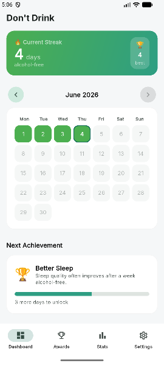
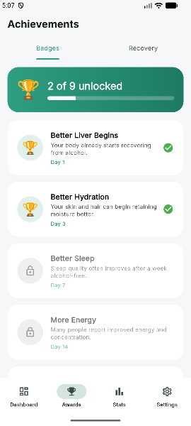
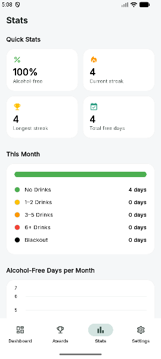

#  Don't Drink

> *Small daily choices. Big long-term changes.*

A mobile app that helps you reduce or eliminate alcohol consumption through daily tracking, streaks, achievements, education, and motivation.

<p align="center">
  
  
  
</p>

---

## Features

### Tracking Modes
The app can track more than alcohol. Turn modes on in **Settings ▸ Modes**, then
switch between them from the dashboard title.

| Mode | Levels | Content |
|---|---|---|
| Don't Drink | None / 1–2 / 3–5 / 6+ / Blackout | Full facts, recovery timeline, awards |
| Don't Smoke | None / 1–5 / 6–15 / 16+ / Chain | Full facts, recovery timeline, awards |
| No Contact | No contact / Thought about it / Checked profile / Reached out | Full facts, recovery timeline, awards |
| Custom | Clean / Slip / Relapse | Generic awards and motivations |

Each mode keeps its own history, streak, calendar and achievements — a relapse
in one mode never touches another. Turning a mode off keeps its data; deleting
a custom mode deletes its days.

### Daily Tracker
Log exactly one status per day per mode by tapping any date. Don't Drink has five levels:

| Status | Color | Meaning |
|---|---|---|
| No Drinks | Green | 0 alcoholic drinks |
| 1–2 Drinks | Yellow | Light drinking |
| 3–5 Drinks | Orange | Moderate drinking |
| 6+ Drinks | Red | Heavy drinking |
| Blackout | Black | Extreme drinking / memory loss |

You can edit any past day. Future days are disabled.

### Streak Counter
The dashboard shows your current alcohol-free streak and your all-time longest streak. If today hasn't been logged yet, the streak is measured through yesterday so the counter doesn't reset just from not opening the app. A tracked day rolls over at 4 AM rather than midnight, so logging a night out at 1 AM records the night that just happened.

### Color-Coded Calendar
Browse any month's color-coded grid. Step month by month, or tap the month name to jump straight to one — months holding entries are picked out in the picker. Tap any day to log or edit it. A **yearly view** shows every day of a year as one cell, so a year reads as a pattern rather than a list.

### Achievement System
Nine streak milestones, earned automatically — and **repeatable**. A badge is earned once per clean run that reaches its threshold, so reaching a week five separate times counts five times, shown as a ×5 with the first and last dates. A relapse costs the streak and never a badge. Legendary milestones fire a confetti celebration on every earn.

| Day | Achievement |
|---|---|
| 1 | Better Liver Begins |
| 3 | Better Hydration |
| 7 | Better Sleep |
| 14 | More Energy |
| 30 | One Month Strong ⭐ |
| 60 | Mental Clarity |
| 90 | New Lifestyle ⭐ |
| 180 | Half-Year Champion ⭐ |
| 365 | One Year Alcohol-Free ⭐ |

### Statistics
Bar chart of alcohol-free days over the last 6 months, a donut of drink-level distribution — tap a slice to see that level's day count — and a headline overview (longest streak, free-day rate, best month).

### Recovery Timeline
A milestone timeline showing what the body gains hour-by-hour and month-by-month when alcohol-free — with your current streak highlighted as "reached."

### Facts & Education
A daily rotating fact card plus browsable lists of alcohol harms and benefits of not drinking.

### Motivation
Swipeable full-bleed motivation cards. Tap *Inspire me* to jump to a random one.

### Notes
Any logged day can carry a note — what happened, how it felt. Days with one are marked in the calendar, and a **Notes** screen lists everything you have written, newest first. Notes are included in backups and never in a shared image.

### Sharing
A month, a year or an earned badge can be shared as an image. The picture carries the grid and the period only — no counts, no rates, and never a note — and a badge card shows exactly what will be shared before it leaves the device.

### Languages
English, German and Italian, covering the interface and the content: achievement names, facts, the recovery timeline, motivations and the level scale. Follows the system language, with an override in Settings.

### Daily Reminder (optional)
An on-device scheduled notification at a time you choose (default 8:00 PM). Can be toggled off at any time. Requires notification permission.

### Theme
Light, dark, or system-default — switchable in Settings.

### Updates
The app installs as a sideloaded APK, so it checks GitHub Releases for a newer
version itself. **Settings ▸ Updates** checks on demand; the app also checks
quietly at most once every 24 hours on launch and puts a dot on the Settings tab
when something newer exists. Downloads show progress, then hand the APK to
Android's installer, which asks you to confirm.

"Later" keeps a version quiet until a newer one appears. A failed background
check is silent — only a check you asked for reports errors. Android-only:
the section is hidden on iOS.

> Release APKs must keep a stable signing key. Android refuses to install an
> update signed with a different key than the installed app, with a confusing
> system error.

---

## Architecture

```
lib/
├── core/
│   ├── models/         # ModeDefinition, TrackedLevel, ContentPack, DayEntry,
│   │                   # Achievement, AppRelease
│   ├── theme/          # AppTheme (Material 3), AppColors
│   └── utils/          # DateOnly helpers
├── data/
│   ├── database/       # AppDatabase (SQLite via sqflite)
│   ├── repositories/   # EntryRepository, ModeRepository, SettingsRepository
│   └── static/
│       └── modes/      # Built-in mode definitions + content packs
├── services/           # StatsService, AchievementService, NotificationService,
│                       # ExportImportService, UpdateService
├── viewmodels/         # TrackerViewModel, ModeViewModel, SettingsViewModel,
│                       # UpdateViewModel
└── ui/
    ├── dashboard/
    ├── calendar/
    ├── achievements/
    ├── statistics/
    ├── recovery/
    ├── facts/
    ├── motivation/
    ├── modes/          # Custom mode editor
    ├── settings/
    ├── more/
    ├── shell/          # HomeShell (NavigationBar)
    └── widgets/        # AppCard, DayEntrySheet, AchievementUnlockDialog, ...
```

Pattern: **MVVM**. ViewModels extend `ChangeNotifier` and are provided via `provider`. Screens read from ViewModels and call ViewModel methods; they do not touch the database directly. All data is local (SQLite + SharedPreferences).

---

## Building

### Prerequisites

| Tool | Version |
|---|---|
| Flutter (via fvm) | pinned in `.fvmrc` (3.44.6 stable) |
| Dart | ships with that Flutter |
| Android SDK | at `~/Android/Sdk` |
| Android NDK | 28.2 (installed in `~/Android/Sdk/ndk/`) |
| Java | 17+ |

Flutter is managed by [fvm](https://fvm.app), pinned in `.fvmrc`. CI and the
release workflow read that same file, so the version that builds a release is
the version you develop on — prefix commands with `fvm` (`fvm flutter test`).

Release builds sign with the shared keystore via `android/key.properties`,
which is gitignored; without it a release build falls back to the debug key so
`flutter run --release` still works on a fresh checkout.

> **Note — SDK path:** `android/local.properties` points at `~/Android/Sdk`. If Flutter rewrites it back to `/opt/android-sdk` during `pub get`, change `sdk.dir` back to `/home/ben/Android/Sdk`. The `/opt` SDK has no NDK and no accepted licenses.

### Run the app

```bash
# With fvm on PATH (or use the full path):
flutter pub get
flutter run
```

### Build a debug APK

```bash
flutter build apk --debug
# Output: build/app/outputs/flutter-apk/app-debug.apk
```

### Build a release APK

```bash
flutter build apk --release
```

### Run tests

```bash
flutter test
```

Covers streak calculation and clean runs, repeatable achievements, monthly
aggregation, the tracked-day rollover, mode definitions and invariants, the
v1→v2 database migration, per-mode entry isolation, mode activation rules,
export/import across modes including notes, translation parity for all three
languages, and a set of widget tests — the log sheet and its dialogs, the mode
editor's keyboard handling, the month picker, the donut, the yearly heatmap,
badge sharing, Settings, and the accessibility labels.

CI runs `flutter analyze` and `flutter test` on every push, and the release
workflow runs them again before it builds, so a tag cannot ship code that does
not pass.

### Static analysis

```bash
flutter analyze
# Expected: No issues found
```

---

## Android Manifest Notes

The app declares `POST_NOTIFICATIONS` and `RECEIVE_BOOT_COMPLETED` for the
optional daily reminder, and `INTERNET` plus `REQUEST_INSTALL_PACKAGES` for the
in-app updater. The media-read permissions that `open_filex` declares are
stripped in the manifest — the updater only ever opens an APK from the app's own
cache directory.

Your tracking data never leaves the device. The only outbound requests are to
`api.github.com` for release metadata and to GitHub's asset host for the APK.

---

## Dependencies

| Package | Purpose |
|---|---|
| `provider` | MVVM state management |
| `sqflite` | Local SQLite database |
| `shared_preferences` | Theme + notification preferences |
| `fl_chart` | Statistics charts |
| `confetti` | Achievement milestone celebrations |
| `flutter_local_notifications` | Optional daily reminder |
| `timezone` | Reliable local-time scheduling |
| `intl` | Date formatting |
| `google_fonts` | Inter typeface |
| `path` | Database path construction |
| `open_filex` | Hands a downloaded APK to Android's package installer |

The Inter typeface is bundled in `assets/fonts/` under the SIL Open Font
License (see `assets/fonts/Inter-LICENSE.txt`), so the app renders its own
typography without contacting Google's font servers.
